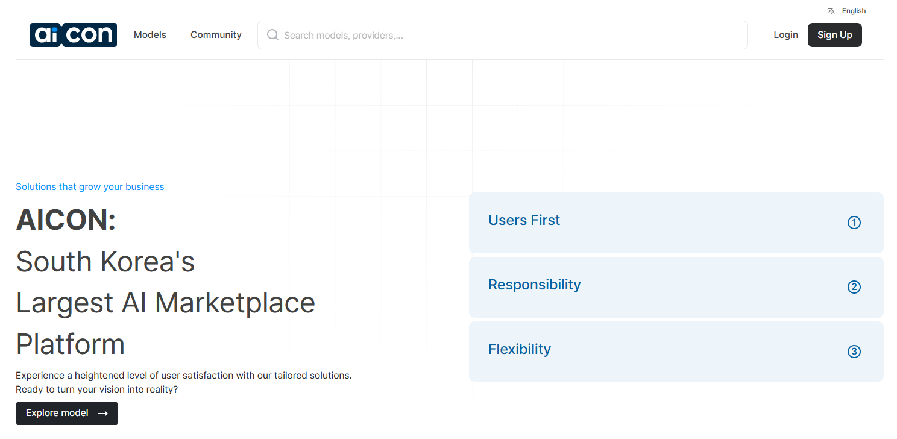

## 1.1. 가이드라인 최종 목표

이 가이드를 숙지함으로써 공급자는 AICON 플랫폼과 원활하게 연동하기 위해 반드시 구현 및 연동해야 하는 다양한 모델 등록 타입과 주요 API(Record Usage, Check Alive, Get Usage For Settlement)에 대한 요건을 정확히 이해할 수 있습니다.

이를 통해 모델의 서비스 모니터링, 사용 이력 기록, 비용 정산 등 전체 연동 과정을 효율적으로 관리함으로써  
- 안정적이고 신속하게 모델을 등록 및 운영할 수 있고  
- 필수 API를 정확한 사양에 맞게 개발·연동할 수 있으며  
- 사용자 이용 이력 관리 및 정산 프로세스를 투명하게 수행할 수 있습니다.

---

## 1.2. 모델 등록 타입 설명

1. **Type 1 – AICON Hosted FE**  
   Provider가 직접 개발하거나 AICON에서 제공하는 샘플 소스를 활용하여 빌드한 프론트엔드 소스를 AICON에 업로드합니다. 해당 마이크로사이트는 AICON 인프라에 배포되며, 외부에 있는 Model의 백엔드와 연동합니다.

2. **Type 2 – AICON Microsite**  
   Provider는 AICON에서 제공하는 기본 마이크로사이트 UI를 사용합니다.  
   a. **Chatting Type**: 실시간 채팅 UI를 통해 Model과 상호작용할 수 있습니다.  
   b. **Multi Input Type**: 파일(img, csv, txt, pdf 등) 업로드 및 결과와 파일 다운로드 기능을 제공합니다.

3. **Type 3 – Model with OAuth or API Key**  
   Provider가 자체적으로 사용자 인터페이스(Microsite)를 개발 및 운영합니다. AICON과는 OAuth 또는 API Key 방식으로 인증과 연동을 진행합니다.

4. **Type 4 – Outlink**  
   Provider가 자체적으로 UI를 구축하여 독립적으로 운영합니다. OAuth 방식으로 인증하며, 서비스는 별도로 제공합니다.

---

## 1.3. 준비 필요 있는 API 설명

1. **API Record Usage**  
   이 API는 AICON에서 개발하며, Provider는 사용자가 Model을 이용할 때마다 해당 사용 이력을 AICON에 전송하도록 이 API를 반드시 연동해야 합니다.  
   **API Format:** `/api/Provider/record-usage`  
   **API Design:** [API Design Record Usage](API Design Record Usage)

2. **API Check Alive**  
   이 API는 Provider가 AICON에서 제공하는 설계 및 포맷에 따라 개발합니다. 사용자가 Model 상세 페이지에서 "Run Model" 버튼을 클릭하면, AICON이 이 API를 호출하여 Model이 정상적으로 운영 중인지 확인합니다.  
   **API Format:** `/api/Provider/is-alive`  
   **API Design:** [API Design Check Alive](API Design Check Alive)

3. **API Get Usage For Settlement**  
   이 API는 Provider가 AICON에서 제공하는 설계 및 포맷에 따라 개발합니다. 매월 정산 시점에 AICON이 해당 API를 호출하면, Provider는 월간 사용자별 Model 사용 이력을 AICON에 전달합니다. AICON은 이 API와 API Record Usage를 토대로 사용자 이용 요금을 산정합니다.  
   **API Format:** `/api/Provider/get-usage-for-settlement`  
   **API Design:** [API Design Get Usage For Settlement](API Design Get Usage For Settlement)

## STEP-01

<table>
<tr>
<td width="70%">

</td>
<td width="30%" valign="top" style="background-color:#f2f2f2; padding:15px; border-radius:10px;">
**STEP-01**  

1. 프로바이더로 **‘로그인’**한 후  
2. 상단 메뉴 바의 **‘모델’** 버튼을 클릭합니다  

</td>
</tr>
</table>
